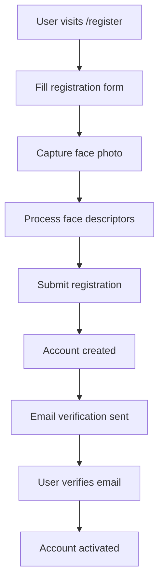
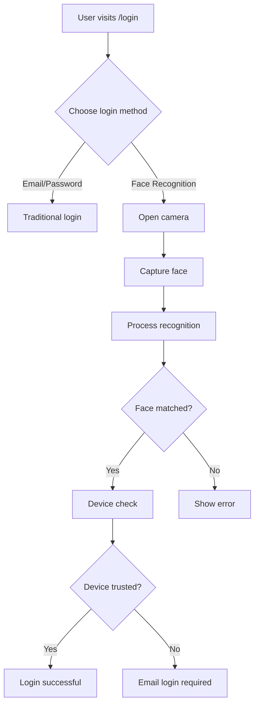
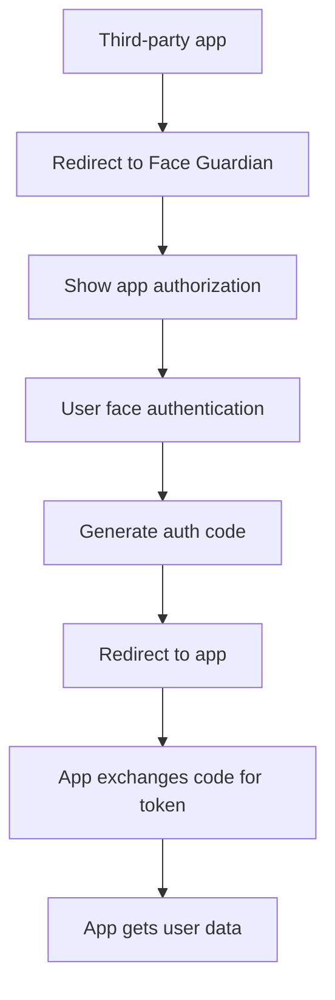

# 🎨 Frontend Documentation

Complete guide to Face Guardian's frontend architecture, components, and development patterns.

---

## 📋 Overview

Face Guardian's frontend is built with Next.js 14, React 18, and TypeScript, providing a modern, responsive interface for facial recognition authentication and OAuth management.

**Tech Stack:**
- **Next.js 14** - React framework with App Router
- **React 18** - UI library with concurrent features
- **TypeScript 5** - Type-safe development
- **Tailwind CSS** - Utility-first styling
- **Face-API.js** - Browser-based face recognition
- **Material-UI** - Component library
- **Supabase** - Database and authentication

---

## 🏗️ Project Structure

```
components/
├── Atom/                    # Atomic components
│   ├── Navbar/             # Navigation bar
│   ├── Table/              # Data table
│   ├── Modal/              # Modal dialogs
│   └── ConfirmationModal/  # Confirmation dialogs
├── Common/                 # Shared components
│   ├── Dashboard/          # Main dashboard
│   ├── Particles/          # Background particles
│   └── UnAuthorize/        # Unauthorized access
├── Layout/                 # Layout components
│   ├── HomeLayout/         # Home page layout
│   └── ParticleLayout/     # Particle background layout
└── Pages/                  # Page-specific components
    ├── Login/              # Login page components
    ├── Register/           # Registration components
    └── Integration/        # OAuth app management
```

---

## 🔑 Key Components

### 1. Face Recognition System

#### `FaceFunction.tsx` (Login)
The core component handling facial recognition for authentication.

```typescript
import { useEffect, useState, useRef } from 'react';
import { loadModels, createMatcher, getFullFaceDescription } from '@/utils/face';
import { useSupabaseClient } from '@supabase/auth-helpers-react';

const FaceFunction = () => {
  const [faceMatcher, setFaceMatcher] = useState<any>(null);
  const [imageURL, setImageURL] = useState<string | null>(null);
  const webcamRef = useRef<any>(null);
  const supabaseClient = useSupabaseClient();

  useEffect(() => {
    const initializeFaceRecognition = async () => {
      // Load face-api.js models
      await loadModels();
      
      // Get existing face data from database
      const data = await faceData(supabaseClient);
      
      // Create face matcher
      const matcher = await createMatcher(data);
      setFaceMatcher(matcher);
    };

    initializeFaceRecognition();
  }, [supabaseClient]);

  const capture = async () => {
    if (webcamRef.current) {
      const imageSrc = webcamRef.current.getScreenshot();
      setImageURL(imageSrc);
      
      // Process face recognition
      const faceDescription = await getFullFaceDescription(imageSrc);
      
      if (faceDescription.length > 0) {
        // Match against stored faces
        const match = faceMatcher.findBestMatch(faceDescription[0].descriptor);
        
        if (match.distance < 0.6) {
          // Successful match - authenticate user
          await authenticateUser(match.label);
        }
      }
    }
  };

  return (
    <div className="face-recognition-container">
      <Webcam
        ref={webcamRef}
        screenshotFormat="image/jpeg"
        videoConstraints={{ facingMode: 'user' }}
      />
      <button onClick={capture}>Capture & Authenticate</button>
      {imageURL && }
    </div>
  );
};
```

#### `FaceFunction.tsx` (Registration)
Similar component for registering new faces.

```typescript
const FaceFunction = ({ setFaceDescriptors }: { setFaceDescriptors: any }) => {
  const capture = async () => {
    if (webcamRef.current) {
      const imageSrc = webcamRef.current.getScreenshot();
      
      // Get face descriptors for new user
      const faceDescription = await getFullFaceDescription(imageSrc);
      
      if (faceDescription.length > 0) {
        // Store descriptors for registration
        setFaceDescriptors(faceDescription[0].descriptor);
        
        toast.success('Face captured successfully!');
      } else {
        toast.error('No face detected. Please try again.');
      }
    }
  };

  // ... rest of component
};
```

### 2. Layout Components

#### `HomeLayout.tsx`
Protected layout for authenticated users.

```typescript
import { useEffect, ReactNode, useState } from 'react';
import { useSession, useSupabaseClient } from '@supabase/auth-helpers-react';
import useUserDataStore from '@/store/userDataStore';

const HomeLayout = ({ children, title, restrict }: {
  children: ReactNode;
  title?: string;
  restrict?: boolean;
}) => {
  const session = useSession();
  const [restrictPage, setRestrictPage] = useState(true);
  const { setUserData } = useUserDataStore();
  const supabaseClient = useSupabaseClient();

  useEffect(() => {
    if (session?.user?.email && restrict) {
      setRestrictPage(false);
    }
  }, [session, restrict]);

  useEffect(() => {
    const getUserData = async () => {
      if (session?.user?.id) {
        const { data, error } = await supabaseClient
          .from('profiles')
          .select('*')
          .eq('id', session.user.id)
          .single();

        if (data) {
          setUserData(data);
        }
      }
    };

    getUserData();
  }, [session, supabaseClient, setUserData]);

  if (restrict && restrictPage) {
    return <UnAuthorize />;
  }

  return (
    <div className="min-h-screen bg-gray-50">
      <Navbar />
      <main className="container mx-auto px-4 py-8">
        {children}
      </main>
    </div>
  );
};
```

#### `ParticleLayout.tsx`
Layout with animated particle background for OAuth flows.

```typescript
const ParticleLayout = ({ children, title, restrict, appData }: {
  children: ReactNode;
  title?: string;
  restrict?: boolean;
  appData?: any;
}) => {
  const session = useSession();
  const router = useRouter();
  const supabaseClient = useSupabaseClient();

  useEffect(() => {
    const createAuthCodeAndRedirect = async () => {
      if (session?.user?.email && restrict) {
        const { redirectTo, redirect_to, id } = appData || {};
        
        if (redirect_to && id && redirectTo) {
          // Generate OAuth authorization code
          const authorizationCode = generateRandomString(30);
          const token = generateRandomString(128);
          
          // Store in database
          const { error } = await supabaseClient.from('tokens').insert([{
            code: authorizationCode,
            token,
            redirect_at: redirectTo,
            app_id: id,
            profile_id: session.user.id,
            expiration_date: new Date(Date.now() + 3600000).toISOString(),
          }]);

          if (!error) {
            // Redirect to third-party app
            const redirectUrl = convertToLink(redirect_to);
            router.push(
              `${redirectTo}?authorizationCode=${authorizationCode}&redirectUrl=${redirectUrl}`
            );
          }
        }
      }
    };

    createAuthCodeAndRedirect();
  }, [session, restrict, appData, router, supabaseClient]);

  return (
    <div className="relative min-h-screen">
      <Particles />
      <div className="relative z-10">
        {children}
      </div>
    </div>
  );
};
```

### 3. OAuth App Management

#### `AppCreation.tsx`
Component for creating new OAuth applications.

```typescript
import { useForm, SubmitHandler } from 'react-hook-form';
import { useSupabaseClient } from '@supabase/auth-helpers-react';
import useUserDataStore from '@/store/userDataStore';

interface IFormInput {
  name: string;
  domain: string;
  redirectTo: string;
}

const AppCreation = ({ setAppList }: { setAppList: any }) => {
  const { register, handleSubmit, formState: { errors } } = useForm<IFormInput>();
  const supabaseClient = useSupabaseClient();
  const { userData } = useUserDataStore();

  const onSubmit: SubmitHandler<IFormInput> = async (appData) => {
    const { data, error } = await supabaseClient
      .from('apps')
      .insert([{
        name: appData.name,
        domain: appData.domain,
        redirect_to: appData.redirectTo,
        profile_id: userData.id,
      }])
      .select();

    if (error) {
      toast.error('Error creating app');
    } else {
      setAppList((prev: any) => [...prev, data[0]]);
      toast.success('App created successfully!');
    }
  };

  return (
    <form onSubmit={handleSubmit(onSubmit)} className="space-y-4">
      <div>
        <label className="block text-sm font-medium text-gray-700">
          App Name
        </label>
        <input
          {...register('name', { required: 'App name is required' })}
          className="mt-1 block w-full rounded-md border-gray-300 shadow-sm"
          placeholder="My Awesome App"
        />
        {errors.name && (
          <span className="text-red-500 text-sm">{errors.name.message}</span>
        )}
      </div>

      <div>
        <label className="block text-sm font-medium text-gray-700">
          Domain
        </label>
        <input
          {...register('domain', { required: 'Domain is required' })}
          className="mt-1 block w-full rounded-md border-gray-300 shadow-sm"
          placeholder="https://myapp.com"
        />
      </div>

      <div>
        <label className="block text-sm font-medium text-gray-700">
          Redirect URL
        </label>
        <input
          {...register('redirectTo', { required: 'Redirect URL is required' })}
          className="mt-1 block w-full rounded-md border-gray-300 shadow-sm"
          placeholder="https://myapp.com/auth/callback"
        />
      </div>

      <button
        type="submit"
        className="w-full bg-blue-600 text-white py-2 px-4 rounded-md hover:bg-blue-700"
      >
        Create App
      </button>
    </form>
  );
};
```

---

## 🎯 User Flows

### 1. Registration Flow



### 2. Login Flow



### 3. OAuth Flow



---

## 🎨 Styling & Theming

### Tailwind Configuration

```javascript
// tailwind.config.js
module.exports = {
  content: [
    './pages/**/*.{js,ts,jsx,tsx}',
    './components/**/*.{js,ts,jsx,tsx}',
  ],
  theme: {
    extend: {
      colors: {
        primary: {
          50: '#eff6ff',
          500: '#3b82f6',
          600: '#2563eb',
          700: '#1d4ed8',
        },
        secondary: {
          50: '#f0f9ff',
          500: '#0ea5e9',
          600: '#0284c7',
        },
      },
      animation: {
        'fade-in': 'fadeIn 0.5s ease-in-out',
        'slide-up': 'slideUp 0.3s ease-out',
      },
    },
  },
  plugins: [],
};
```

### Component Styling Patterns

```typescript
// Consistent button styling
const Button = ({ variant = 'primary', size = 'md', children, ...props }) => {
  const baseClasses = 'font-medium rounded-md focus:outline-none focus:ring-2';
  const variants = {
    primary: 'bg-blue-600 text-white hover:bg-blue-700 focus:ring-blue-500',
    secondary: 'bg-gray-200 text-gray-900 hover:bg-gray-300 focus:ring-gray-500',
  };
  const sizes = {
    sm: 'px-3 py-1.5 text-sm',
    md: 'px-4 py-2 text-base',
    lg: 'px-6 py-3 text-lg',
  };

  return (
    <button
      className={`${baseClasses} ${variants[variant]} ${sizes[size]}`}
      {...props}
    >
      {children}
    </button>
  );
};
```

---

## 🔧 State Management

### Zustand Store Example

```typescript
// store/userDataStore.ts
import { create } from 'zustand';

interface UserData {
  id: string;
  email: string;
  first_name: string;
  last_name: string;
  authenticated: boolean;
}

interface UserDataStore {
  userData: UserData | null;
  setUserData: (data: UserData) => void;
  clearUserData: () => void;
}

const useUserDataStore = create<UserDataStore>((set) => ({
  userData: null,
  setUserData: (data) => set({ userData: data }),
  clearUserData: () => set({ userData: null }),
}));

export default useUserDataStore;
```

### Usage in Components

```typescript
const Dashboard = () => {
  const { userData, setUserData } = useUserDataStore();
  
  if (!userData) {
    return <div>Loading...</div>;
  }

  return (
    <div>
      <h1>Welcome, {userData.first_name}!</h1>
      {/* Dashboard content */}
    </div>
  );
};
```

---

## 🧪 Testing Patterns

### Component Testing

```typescript
// __tests__/components/FaceFunction.test.tsx
import { render, screen, fireEvent } from '@testing-library/react';
import FaceFunction from '@/components/Pages/Login/FaceRecognition/FaceFunction';

// Mock face-api.js
jest.mock('@/utils/face', () => ({
  loadModels: jest.fn(),
  createMatcher: jest.fn(),
  getFullFaceDescription: jest.fn(),
}));

describe('FaceFunction', () => {
  it('renders camera component', () => {
    render(<FaceFunction />);
    expect(screen.getByText('Capture & Authenticate')).toBeInTheDocument();
  });

  it('captures face on button click', async () => {
    render(<FaceFunction />);
    const captureButton = screen.getByText('Capture & Authenticate');
    
    fireEvent.click(captureButton);
    
    // Add assertions for face capture
  });
});
```

### Integration Testing

```typescript
// __tests__/integration/auth-flow.test.tsx
import { render, screen, waitFor } from '@testing-library/react';
import userEvent from '@testing-library/user-event';
import { SessionContextProvider } from '@supabase/auth-helpers-react';
import LoginPage from '@/pages/login';

describe('Authentication Flow', () => {
  it('completes face authentication flow', async () => {
    const user = userEvent.setup();
    
    render(
      <SessionContextProvider>
        <LoginPage />
      </SessionContextProvider>
    );

    // Test face authentication flow
    const faceAuthButton = screen.getByText('Use Face Authentication');
    await user.click(faceAuthButton);
    
    await waitFor(() => {
      expect(screen.getByText('Camera')).toBeInTheDocument();
    });
  });
});
```

---

## 🚀 Performance Optimization

### Code Splitting

```typescript
// Dynamic imports for heavy components
import dynamic from 'next/dynamic';

const FaceFunction = dynamic(
  () => import('@/components/Pages/Login/FaceRecognition/FaceFunction'),
  {
    loading: () => <div>Loading face recognition...</div>,
    ssr: false, // Disable SSR for camera components
  }
);
```

### Image Optimization

```typescript
import Image from 'next/image';

const ProfilePicture = ({ src, alt }) => (
  <Image
    src={src}
    alt={alt}
    width={150}
    height={150}
    className="rounded-full"
    priority={false}
    placeholder="blur"
    blurDataURL="data:image/jpeg;base64,/9j/4AAQSkZJRgABAQAAAQABAAD/2wBDAAYEBQYFBAYGBQYHBwYIChAKCgkJChQODwwQFxQYGBcUFhYaHSUfGhsjHBYWICwgIyYnKSopGR8tMC0oMCUoKSj/2wBDAQcHBwoIChMKChMoGhYaKCgoKCgoKCgoKCgoKCgoKCgoKCgoKCgoKCgoKCgoKCgoKCgoKCgoKCgoKCgoKCgoKCj/wAARCAABAAEDASIAAhEBAxEB/8QAFQABAQAAAAAAAAAAAAAAAAAAAAv/xAAUEAEAAAAAAAAAAAAAAAAAAAAA/8QAFQEBAQAAAAAAAAAAAAAAAAAAAAX/xAAUEQEAAAAAAAAAAAAAAAAAAAAA/9oADAMBAAIRAxAAPwCdABmX/9k="
  />
);
```

---

## 🔗 Related Documentation

- [API Reference](./api.md)
- [Database Schema](../database/README.md)
- [Environment Variables](./env.md)
- [Security Best Practices](./security.md)

---

## 📞 Support

For frontend development questions:

1. **Check component examples** above
2. **Review the project structure** for organization patterns
3. **Test with development server** (`npm run dev`)
4. **Open an issue** with specific component questions 