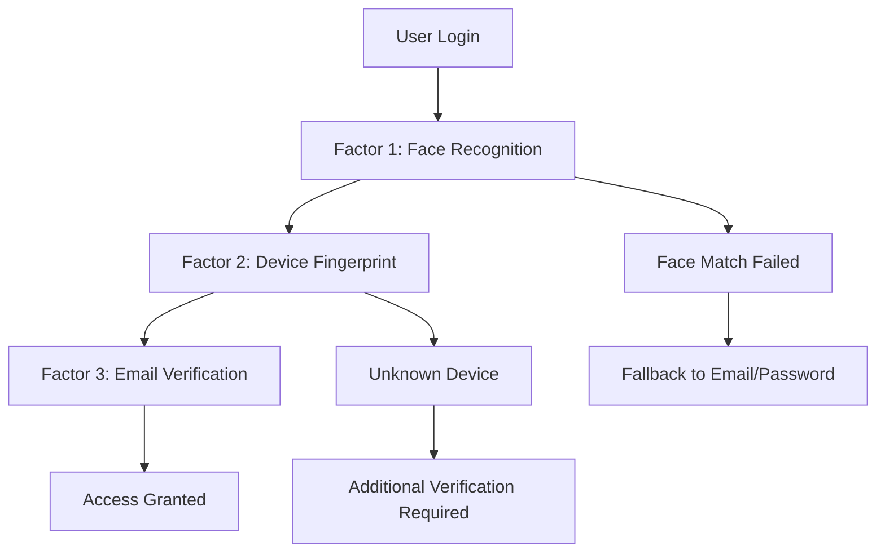

# 🛡️ Security Documentation

Comprehensive security guide for Face Guardian's facial recognition OAuth system.

---

## 📋 Security Overview

Face Guardian implements multi-layered security architecture to protect user biometric data, OAuth tokens, and system integrity. This document covers all security aspects from data protection to infrastructure hardening.

**Security Principles:**
- **Zero Trust Architecture** - Never trust, always verify
- **Defense in Depth** - Multiple security layers
- **Least Privilege** - Minimal required permissions
- **Privacy by Design** - Data protection built-in
- **Continuous Monitoring** - Real-time threat detection

---

## 🔐 Authentication Security

### Multi-Factor Authentication (MFA)

Face Guardian implements a robust MFA system combining:



### Face Recognition Security

#### **Biometric Data Protection**
```typescript
// Face descriptor encryption
const encryptFaceDescriptor = (descriptor: Float32Array) => {
  const key = process.env.FACE_DESCRIPTOR_ENCRYPTION_KEY;
  const encrypted = CryptoJS.AES.encrypt(
    JSON.stringify(Array.from(descriptor)), 
    key
  ).toString();
  return encrypted;
};

// Secure storage - never store raw images
const storeFaceDescriptor = async (userId: string, descriptor: Float32Array) => {
  const encryptedDescriptor = encryptFaceDescriptor(descriptor);
  
  await supabase
    .from('face_descriptors')
    .insert({
      profile_id: userId,
      descriptors: encryptedDescriptor, // Stored encrypted
      quality_score: calculateQuality(descriptor),
      created_at: new Date().toISOString()
    });
};
```

#### **Anti-Spoofing Measures**
```typescript
// Liveness detection
const performLivenessCheck = async (imageData: string) => {
  const faceDetection = await faceapi.detectSingleFace(imageData);
  
  // Check for 3D face properties
  const landmarks = await faceapi.detectFaceLandmarks(imageData);
  const expressions = await faceapi.detectFaceExpressions(imageData);
  
  // Validate liveness indicators
  const isLive = validateLiveness(landmarks, expressions);
  
  if (!isLive) {
    throw new Error('Liveness check failed - please use a live face');
  }
  
  return faceDetection;
};
```

### Device Trust Management

#### **Device Fingerprinting**
```typescript
// Secure device identification
const generateDeviceFingerprint = async () => {
  const fp = await FingerprintJS.load();
  const result = await fp.get();
  
  // Additional entropy sources
  const deviceInfo = {
    visitorId: result.visitorId,
    userAgent: navigator.userAgent,
    screen: `${screen.width}x${screen.height}`,
    timezone: Intl.DateTimeFormat().resolvedOptions().timeZone,
    language: navigator.language,
    timestamp: Date.now()
  };
  
  return CryptoJS.SHA256(JSON.stringify(deviceInfo)).toString();
};

// Trust verification
const verifyDeviceTrust = async (userId: string, deviceId: string) => {
  const { data: device } = await supabase
    .from('profile_devices')
    .select('is_trusted, last_used_at')
    .eq('profile_id', userId)
    .eq('device_id', deviceId)
    .single();
  
  if (!device) {
    // New device - require additional verification
    return { trusted: false, reason: 'unknown_device' };
  }
  
  if (!device.is_trusted) {
    return { trusted: false, reason: 'device_not_trusted' };
  }
  
  // Check for suspicious activity
  const daysSinceLastUse = (Date.now() - new Date(device.last_used_at).getTime()) / (1000 * 60 * 60 * 24);
  if (daysSinceLastUse > 90) {
    return { trusted: false, reason: 'device_inactive' };
  }
  
  return { trusted: true };
};
```

---

## 🔒 Data Protection

### Encryption Standards

#### **Data at Rest**
```sql
-- Database-level encryption
CREATE TABLE face_descriptors (
    id UUID PRIMARY KEY DEFAULT uuid_generate_v4(),
    profile_id UUID NOT NULL,
    descriptors TEXT NOT NULL, -- AES-256 encrypted
    quality_score FLOAT4,
    created_at TIMESTAMPTZ DEFAULT NOW(),
    updated_at TIMESTAMPTZ DEFAULT NOW()
);

-- Column-level encryption for sensitive data
ALTER TABLE face_descriptors ALTER COLUMN descriptors 
SET DATA TYPE TEXT USING pgp_sym_encrypt(descriptors, 'encryption_key');
```

#### **Data in Transit**
```typescript
// HTTPS-only configuration
const securityHeaders = {
  'Strict-Transport-Security': 'max-age=31536000; includeSubDomains',
  'X-Content-Type-Options': 'nosniff',
  'X-Frame-Options': 'DENY',
  'X-XSS-Protection': '1; mode=block',
  'Referrer-Policy': 'strict-origin-when-cross-origin',
  'Content-Security-Policy': "default-src 'self'; script-src 'self' 'unsafe-inline'; style-src 'self' 'unsafe-inline'"
};

// API route protection
export default function handler(req: NextApiRequest, res: NextApiResponse) {
  // Apply security headers
  Object.entries(securityHeaders).forEach(([key, value]) => {
    res.setHeader(key, value);
  });
  
  // Validate HTTPS in production
  if (process.env.NODE_ENV === 'production' && !req.headers['x-forwarded-proto']?.includes('https')) {
    return res.status(400).json({ error: 'HTTPS required' });
  }
  
  // Continue with API logic
}
```

### Data Retention & Deletion

#### **Automatic Data Purging**
```sql
-- Function to clean expired data
CREATE OR REPLACE FUNCTION cleanup_expired_data()
RETURNS INTEGER AS $$
DECLARE
    deleted_count INTEGER;
BEGIN
    -- Delete expired tokens
    DELETE FROM tokens 
    WHERE expires_at < NOW() 
    OR expiration_date < NOW();
    
    -- Delete inactive devices (older than 1 year)
    DELETE FROM profile_devices 
    WHERE last_used_at < NOW() - INTERVAL '1 year';
    
    -- Delete unverified accounts (older than 30 days)
    DELETE FROM profiles 
    WHERE authenticated = FALSE 
    AND created_at < NOW() - INTERVAL '30 days';
    
    GET DIAGNOSTICS deleted_count = ROW_COUNT;
    RETURN deleted_count;
END;
$$ LANGUAGE plpgsql;

-- Schedule cleanup (run daily)
SELECT cron.schedule('cleanup-expired-data', '0 2 * * *', 'SELECT cleanup_expired_data();');
```

#### **GDPR Compliance**
```typescript
// User data export
const exportUserData = async (userId: string) => {
  const userData = await supabase
    .from('profiles')
    .select(`
      *,
      face_descriptors(*),
      profile_devices(*),
      apps(*),
      tokens(*)
    `)
    .eq('id', userId)
    .single();
  
  // Anonymize sensitive data
  const exportData = {
    ...userData,
    face_descriptors: userData.face_descriptors.map(fd => ({
      ...fd,
      descriptors: '[ENCRYPTED_BIOMETRIC_DATA]'
    }))
  };
  
  return exportData;
};

// User data deletion
const deleteUserData = async (userId: string) => {
  const { error } = await supabase.rpc('delete_user_completely', {
    user_id: userId
  });
  
  if (error) {
    throw new Error(`Failed to delete user data: ${error.message}`);
  }
  
  // Log deletion for compliance
  await auditLog({
    action: 'user_data_deleted',
    user_id: userId,
    timestamp: new Date().toISOString(),
    compliance_reason: 'GDPR_deletion_request'
  });
};
```

---

## 🔐 OAuth Security

### Token Management

#### **Secure Token Generation**
```typescript
// Cryptographically secure token generation
const generateSecureToken = (length: number = 128) => {
  return crypto.randomBytes(length).toString('hex');
};

// JWT-based access tokens
const createAccessToken = (userId: string, appId: string, scopes: string[]) => {
  const payload = {
    sub: userId,
    aud: appId,
    iss: 'face-guardian.com',
    iat: Math.floor(Date.now() / 1000),
    exp: Math.floor(Date.now() / 1000) + 3600, // 1 hour
    scopes: scopes
  };
  
  return jwt.sign(payload, process.env.JWT_SECRET, { algorithm: 'HS256' });
};

// Token validation
const validateAccessToken = (token: string) => {
  try {
    const decoded = jwt.verify(token, process.env.JWT_SECRET);
    return { valid: true, payload: decoded };
  } catch (error) {
    return { valid: false, error: error.message };
  }
};
```

#### **Token Rotation & Revocation**
```typescript
// Automatic token rotation
const rotateTokens = async (userId: string) => {
  // Revoke existing tokens
  await supabase
    .from('tokens')
    .update({ is_revoked: true })
    .eq('profile_id', userId);
  
  // Generate new tokens
  const newTokens = await generateNewTokens(userId);
  
  return newTokens;
};

// Token revocation endpoint
export default async function revokeToken(req: NextApiRequest, res: NextApiResponse) {
  const { token } = req.body;
  
  const { error } = await supabase
    .from('tokens')
    .update({ 
      is_revoked: true,
      revoked_at: new Date().toISOString()
    })
    .eq('token', token);
  
  if (error) {
    return res.status(500).json({ error: 'Token revocation failed' });
  }
  
  res.json({ message: 'Token revoked successfully' });
}
```

### API Security

#### **Rate Limiting**
```typescript
// Redis-based rate limiting
const rateLimit = async (identifier: string, maxRequests: number, windowMs: number) => {
  const key = `rate_limit:${identifier}`;
  const current = await redis.get(key);
  
  if (current && parseInt(current) >= maxRequests) {
    throw new Error('Rate limit exceeded');
  }
  
  await redis.multi()
    .incr(key)
    .expire(key, Math.ceil(windowMs / 1000))
    .exec();
};

// Apply rate limiting to API routes
export default async function handler(req: NextApiRequest, res: NextApiResponse) {
  const clientIP = req.headers['x-forwarded-for'] || req.connection.remoteAddress;
  
  try {
    await rateLimit(clientIP, 100, 60000); // 100 requests per minute
  } catch (error) {
    return res.status(429).json({ error: 'Too many requests' });
  }
  
  // Continue with API logic
}
```

#### **Input Validation & Sanitization**
```typescript
// Comprehensive input validation
const validateApiInput = (schema: any) => {
  return (req: NextApiRequest, res: NextApiResponse, next: Function) => {
    const { error } = schema.validate(req.body);
    
    if (error) {
      return res.status(400).json({
        error: 'Invalid input',
        details: error.details.map(d => d.message)
      });
    }
    
    next();
  };
};

// Example validation schema
const authenticateSchema = Joi.object({
  appId: Joi.string().uuid().required(),
  userId: Joi.string().uuid().optional(),
  captchaToken: Joi.string().min(10).required()
});

// SQL injection prevention
const safeQuery = async (query: string, params: any[]) => {
  // Use parameterized queries
  const { data, error } = await supabase
    .from('table')
    .select('*')
    .eq('column', params[0]); // Supabase automatically sanitizes
  
  return { data, error };
};
```

---

## 🔒 Infrastructure Security

### Network Security

#### **CORS Configuration**
```typescript
// next.config.js
module.exports = {
  async headers() {
    return [
      {
        source: '/api/:path*',
        headers: [
          {
            key: 'Access-Control-Allow-Origin',
            value: process.env.NODE_ENV === 'production' 
              ? 'https://face-guardian.com' 
              : 'http://localhost:3000'
          },
          {
            key: 'Access-Control-Allow-Methods',
            value: 'GET,POST,PUT,DELETE,OPTIONS'
          },
          {
            key: 'Access-Control-Allow-Headers',
            value: 'Content-Type, Authorization'
          }
        ]
      }
    ];
  }
};
```

#### **Firewall Rules**
```bash
# UFW firewall configuration
sudo ufw default deny incoming
sudo ufw default allow outgoing
sudo ufw allow ssh
sudo ufw allow 'Nginx Full'
sudo ufw allow 443/tcp
sudo ufw enable

# Fail2ban for brute force protection
sudo apt-get install fail2ban
sudo systemctl enable fail2ban
sudo systemctl start fail2ban
```

### Database Security

#### **Row Level Security (RLS)**
```sql
-- Enable RLS on all tables
ALTER TABLE profiles ENABLE ROW LEVEL SECURITY;
ALTER TABLE face_descriptors ENABLE ROW LEVEL SECURITY;
ALTER TABLE profile_devices ENABLE ROW LEVEL SECURITY;
ALTER TABLE apps ENABLE ROW LEVEL SECURITY;
ALTER TABLE tokens ENABLE ROW LEVEL SECURITY;

-- Profiles policies
CREATE POLICY "Users can view own profile" 
    ON profiles FOR SELECT 
    USING (auth.uid() = id);

CREATE POLICY "Users can update own profile" 
    ON profiles FOR UPDATE 
    USING (auth.uid() = id);

-- Face descriptors policies
CREATE POLICY "Users can view own face descriptors" 
    ON face_descriptors FOR SELECT 
    USING (auth.uid() = profile_id);

CREATE POLICY "Users can insert own face descriptors" 
    ON face_descriptors FOR INSERT 
    WITH CHECK (auth.uid() = profile_id);

-- Audit logging
CREATE TABLE audit_logs (
    id UUID PRIMARY KEY DEFAULT uuid_generate_v4(),
    user_id UUID,
    action TEXT NOT NULL,
    table_name TEXT,
    old_values JSONB,
    new_values JSONB,
    timestamp TIMESTAMPTZ DEFAULT NOW()
);

-- Audit trigger function
CREATE OR REPLACE FUNCTION audit_trigger()
RETURNS TRIGGER AS $$
BEGIN
    INSERT INTO audit_logs (user_id, action, table_name, old_values, new_values)
    VALUES (
        auth.uid(),
        TG_OP,
        TG_TABLE_NAME,
        CASE WHEN TG_OP = 'DELETE' THEN row_to_json(OLD) ELSE NULL END,
        CASE WHEN TG_OP = 'INSERT' THEN row_to_json(NEW) ELSE NULL END
    );
    
    RETURN COALESCE(NEW, OLD);
END;
$$ LANGUAGE plpgsql;

-- Apply audit triggers
CREATE TRIGGER audit_profiles
    AFTER INSERT OR UPDATE OR DELETE ON profiles
    FOR EACH ROW EXECUTE FUNCTION audit_trigger();
```

---

## 🔍 Monitoring & Incident Response

### Security Monitoring

#### **Anomaly Detection**
```typescript
// Suspicious activity detection
const detectAnomalies = async (userId: string, action: string, metadata: any) => {
  const recentActivity = await supabase
    .from('audit_logs')
    .select('*')
    .eq('user_id', userId)
    .gte('timestamp', new Date(Date.now() - 24 * 60 * 60 * 1000).toISOString())
    .order('timestamp', { ascending: false });
  
  const anomalies = [];
  
  // Check for unusual login patterns
  if (action === 'login') {
    const loginAttempts = recentActivity.filter(log => log.action === 'login');
    if (loginAttempts.length > 10) {
      anomalies.push('excessive_login_attempts');
    }
    
    // Check for geographic anomalies
    if (metadata.location && isUnusualLocation(metadata.location, loginAttempts)) {
      anomalies.push('unusual_location');
    }
  }
  
  // Check for rapid API calls
  if (recentActivity.length > 1000) {
    anomalies.push('high_api_usage');
  }
  
  if (anomalies.length > 0) {
    await alertSecurityTeam(userId, anomalies, metadata);
  }
};

// Real-time security alerts
const alertSecurityTeam = async (userId: string, anomalies: string[], metadata: any) => {
  const alert = {
    severity: 'HIGH',
    user_id: userId,
    anomalies,
    metadata,
    timestamp: new Date().toISOString()
  };
  
  // Send to security monitoring system
  await sendToSecuritySystem(alert);
  
  // Log security event
  await supabase
    .from('security_events')
    .insert({
      user_id: userId,
      event_type: 'anomaly_detected',
      severity: 'HIGH',
      details: alert
    });
};
```

#### **Incident Response**
```typescript
// Automated incident response
const handleSecurityIncident = async (incident: SecurityIncident) => {
  switch (incident.type) {
    case 'brute_force_attack':
      await blockIPAddress(incident.source_ip);
      await notifySecurityTeam(incident);
      break;
      
    case 'data_breach_attempt':
      await lockUserAccount(incident.user_id);
      await invalidateAllTokens(incident.user_id);
      await escalateToSecurityTeam(incident);
      break;
      
    case 'unusual_biometric_activity':
      await requireAdditionalVerification(incident.user_id);
      await auditBiometricData(incident.user_id);
      break;
      
    default:
      await logIncident(incident);
  }
};
```

---

## 📋 Compliance & Regulations

### GDPR Compliance

#### **Data Processing Principles**
- **Lawfulness**: Clear legal basis for processing
- **Purpose Limitation**: Data used only for specified purposes
- **Data Minimization**: Only necessary data collected
- **Accuracy**: Data kept accurate and up-to-date
- **Storage Limitation**: Data kept only as long as necessary
- **Security**: Appropriate security measures implemented

#### **User Rights Implementation**
```typescript
// Right to Access
const getUserData = async (userId: string) => {
  const data = await exportUserData(userId);
  return {
    personal_data: data,
    processing_purpose: 'Facial recognition authentication',
    retention_period: '3 years or until account deletion',
    data_sources: ['User registration', 'Biometric capture'],
    sharing_details: 'Data not shared with third parties'
  };
};

// Right to Rectification
const updateUserData = async (userId: string, updates: any) => {
  const { error } = await supabase
    .from('profiles')
    .update(updates)
    .eq('id', userId);
  
  if (!error) {
    await auditLog({
      action: 'data_rectification',
      user_id: userId,
      changes: updates
    });
  }
};

// Right to Erasure
const deleteUserData = async (userId: string) => {
  // Delete all related data
  await supabase.from('tokens').delete().eq('profile_id', userId);
  await supabase.from('face_descriptors').delete().eq('profile_id', userId);
  await supabase.from('profile_devices').delete().eq('profile_id', userId);
  await supabase.from('apps').delete().eq('profile_id', userId);
  await supabase.from('profiles').delete().eq('id', userId);
  
  await auditLog({
    action: 'data_erasure',
    user_id: userId,
    reason: 'User requested deletion'
  });
};
```

### SOC 2 Compliance

#### **Security Controls**
```typescript
// Access control matrix
const accessControls = {
  'system_admin': ['read', 'write', 'delete', 'admin'],
  'developer': ['read', 'write'],
  'support': ['read'],
  'auditor': ['read', 'audit']
};

// Audit logging
const auditLog = async (event: AuditEvent) => {
  await supabase
    .from('audit_logs')
    .insert({
      user_id: event.user_id,
      action: event.action,
      resource: event.resource,
      timestamp: new Date().toISOString(),
      ip_address: event.ip_address,
      user_agent: event.user_agent,
      result: event.result
    });
};
```

---

## 🚨 Security Best Practices

### For Developers

#### **Secure Development Practices**
```typescript
// 1. Input validation
const validateInput = (input: any, schema: any) => {
  const { error, value } = schema.validate(input);
  if (error) throw new Error(`Validation failed: ${error.message}`);
  return value;
};

// 2. Error handling (don't expose sensitive info)
const handleError = (error: Error, res: NextApiResponse) => {
  console.error('Security error:', error);
  res.status(500).json({ 
    error: 'Internal server error',
    // Don't expose stack traces in production
    ...(process.env.NODE_ENV === 'development' && { stack: error.stack })
  });
};

// 3. Secure configuration
const secureConfig = {
  database: {
    ssl: process.env.NODE_ENV === 'production',
    connectionLimit: 20,
    acquireTimeout: 60000,
    timeout: 60000
  },
  session: {
    secret: process.env.SESSION_SECRET,
    resave: false,
    saveUninitialized: false,
    cookie: {
      secure: process.env.NODE_ENV === 'production',
      httpOnly: true,
      maxAge: 24 * 60 * 60 * 1000 // 24 hours
    }
  }
};
```

### For Users

#### **Account Security**
- **Strong passwords**: Use unique, complex passwords
- **Two-factor authentication**: Enable 2FA when available
- **Device management**: Regularly review trusted devices
- **Activity monitoring**: Check login history regularly
- **Data awareness**: Understand what data is collected

#### **Privacy Protection**
- **Camera permissions**: Only grant camera access when needed
- **Biometric data**: Understand how face data is stored
- **Account deletion**: Know your rights to delete data
- **Third-party apps**: Review OAuth permissions carefully

---

## 🔗 Related Documentation

- [Database Security](../database/README.md#security-features)
- [API Security](./api.md#security-considerations)
- [Environment Variables](./env.md#security-best-practices)
- [Frontend Security](./frontend.md#performance-optimization)

---

## 📞 Security Support

For security-related concerns:

1. **Security vulnerabilities**: Email security@face-guardian.com
2. **Bug bounty program**: Visit /security/bug-bounty
3. **Compliance questions**: Contact compliance@face-guardian.com
4. **General security**: Open an issue with [SECURITY] tag

**Response Times:**
- Critical vulnerabilities: 24 hours
- High severity: 72 hours
- Medium/Low severity: 1 week 